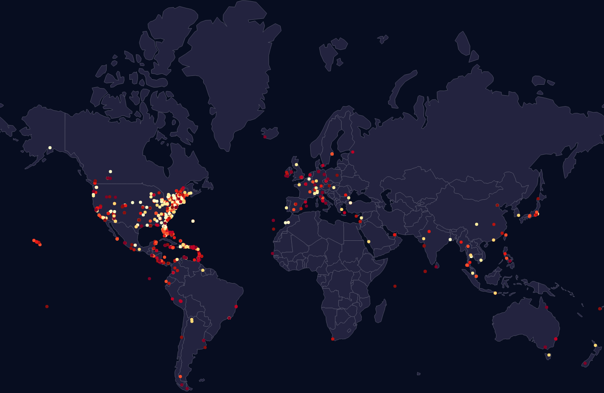
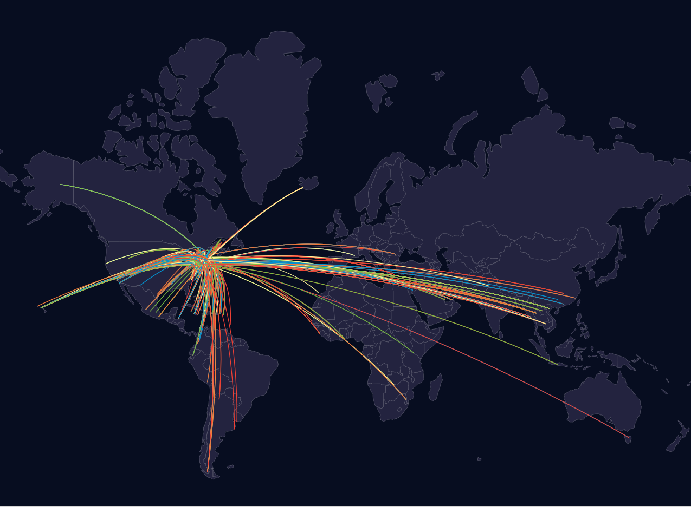

# Datafest 2017
A project which renders a map with points based on csv data. The map represents a certain aspect of
an Expedia dataset.

## Meaning
The first map shows the number of days in advance a particular consumer was looking for a hotel in the 
month of December. A pdf of our presentation can be found in the res folder!

## CSV format
The csv format is "latitude,longitude,weight" where weight is an integer or float correlated with the 
darkness of the circle which will be plotted at the specified latitude and longitude. The header names
are irrelevant, however a header line must be present.

## How do I use this?
First obtain some data in the specified csv format and point to it in line 16 of index.html.
Then you're good to go! Run a quick webserver, I personally used `python -m http.server`, and
open up the link in your browser. The map should show your data!

